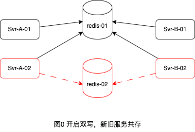
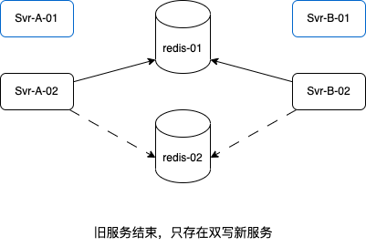
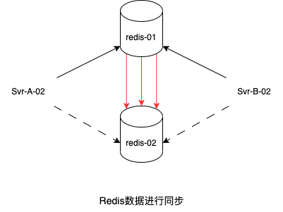
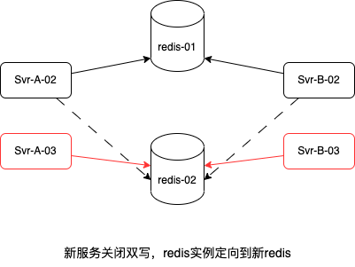
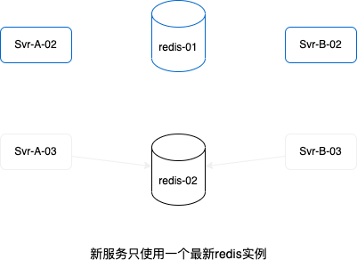

# redis 数据迁移

## 处理要素

- pt、veeka 平台的 redis 存储迁移成独立实例。 ps 已经是独立实例，国内平台 banban 不需要处理
- 在新老服务同时存在的情况下，不影响玩家流程和数据；尤其是老服务可能很久不会 close

## redis 使用涉及功能

1. 游戏服务
   - garden 庄园（未上线）
   - richman 大富翁（未上线）
   - jackpot(仅在 ps 上线)
   - tower-pk（只在 bb 上线）
   - 俄罗斯方块
   - roomMathch（已废弃，可删除？？）

2. 通用服务与功能
   - 匹配服务
   - 游戏排行榜（周榜、总榜）
   - 机器人服务（飞行棋、桌球、撞球、俄罗斯方块）（暂时未上线）

## redis RedisGame具体使用出处
1. game-center:
   * 主要是匹配逻辑，以及对匹配池房间和玩家进行管理
   ```bash
   gam-s-gameframe/gamenode/game_room_manager.go gameRoomManager gameRdb
   rpc/server/internal/gamecenter/match_table.go GameCenter CommonRedis/RoomRedis/UserRedis
   rpc/server/internal/gamecenter/dao/common_redis.go commonRedis rds/redisLock | lockKey : ("%s.%s.%d", matchInfo.FactoryType, matchInfo.Area, matchInfo.AppID)
   ```
2. game_work:
   * 游戏网关，与app（房间网关）之间通信
   ```bash
   rpc/server/internal/game_work/handler/game_node_handler.go gameNodeHandler rdbClient/rdbLock | lockKey: "k1:包含房间id  K2:包含uid"
   rpc/server/internal/game_work/handler/pk_game_handler.go PkGameHandler gameRds/gameRdsLock | lockKey: "room.game.virtual.game.rid.grid.lock_" + rid
   ```

3. garden:
   * 功能暂时未上线
   ```bash
   app/service/garden/friend_service.go friendService rds
   app/service/garden/land_service.go LandService rds/redisLock | lockkey: "appID+uid" 
   ```

4. jackpot:
   * 目前仅在ps上线
   ```bash
   app/api/jackpot_ctl/cache/global_cache.go GlobalCache redis/redisLock/initRedisLock | redisLock lockKey:"room.game.jackpot.jack.status_lock" + appID | initRedisLock lockKey:"room.game.jackpot.global_lock" + appID
   app/api/jackpot_ctl/cache/jackpot_cache.go JackpotRecordCache redis
   app/api/jackpot_ctl/jackpot.go jackpotController redisLock | lockkey: "room.game.jackpot.player_lock_" + uid + appID
   app/api/jackpot_ctl/gots/v8_processor.go V8Processor redis
   ```

5. tetris
   * 俄罗斯方块，独立存储一个gift使用数据
   ```bash
   rpc/server/internal/tetris/game_gift.go 直接接口调用
   ```

6. room_match
   * 据了解是暂未使用的rpc服务（代码中有不合适的接口调用）
   ```bash
   rpc/server/internal/room_match/room_table.go RoomMatch userRedis/commonRedis(Nil)
   ```
7. robot-service
   * 机器人服务
   ```bash
   rpc/server/internal/robot/robot_redis_common.go CommonRedis rds/redisLock | lockkey: fmt.Sprintf("%s.%s", service, language)
   rpc/server/internal/robot/user_redis.go UserRedis rds/locker | lockkey: PoolLockKey(appid + language)
   ```
8. 排行榜
   * 排行榜相关
   ```bash
   gam-s-gametable/table/basetable_ranktable.go 排榜行相关接口的直接调用 周榜/总榜 积分明细
   ```
   
9. 其他
   * rpc基础框架（据说这个key也被废弃）
     ```bash
     gam-s-gametable/table/node.go # 接口RPCGameServer 设置key room.match.factory_type
     ```
   
   * 游戏数据计数插件
     ```bash
     gam-s-gametable/table/plugin/game_count.go gameCountPlugin gameRedis
     ```

   * 货币化结算默认（非veeka与ps）
     ```bash
     # DefaultJoinFeeCmp
     gam-s-gametable/table/join_fee_score.go # 接口GetBalance/SaveSettleData 一个查询，一个纯用了个分布式锁
     ```
## 不停服redis数据迁移操作步骤
- 第0步，当前服务存储状态


- 第1步，开启双写，业务上实现对两个数据库进行操作



- 第2步，等到单写服务全部stop，剩下的全部都是双写服务



- 第3步，同步redis数据，保证redis-01与redis-02数据完全一致



- 第4步，在保留双写服务的同时，新启服务，redis实例操作改为单实例，并且使用新redis



- 第5步，等待双写服务自动死亡，剩下的都是迁移完成的新实例



## 操作过程需要特别注意事项：
1. 设置双写开关，对应逻辑进行双redis实例数据写入
2. 注意分布式锁的使用，双写的时候，未了方便迁移，同时在两个redis中上锁
3. 在第三步，同步redis数据过程中，要确保新redis数据与旧redis数据完成一致（增删改查）